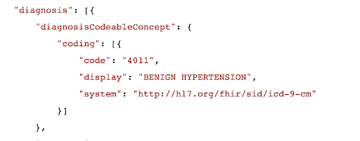
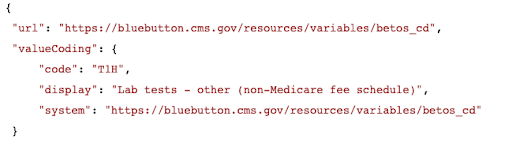

## What is FHIR?
FHIR (Fast Healthcare Interoperability Resources) is a specification for exchanging healthcare data electronically. BCDA sends data acquired through the Blue Button API, which is structured using the FHIR standard, making it more available, discoverable, and understandable. The FHIR standard is developed by HL7, a group dedicated to creating standardized ways of sharing and structuring health care data.
In FHIR, standardized data is structured on a basic building block called a "Resource." All "exchangeable" data is defined as a resource, and a resource is made up of data that systems or computers can easily understand (as well as a part that is more readable by humans).
BCDA is one of CMS’ first APIs to use the bulk FHIR specification, which means BCDA sends back records on all of an ACO’s assigned or assignable beneficiaries, rather than on a patient-by-patient basis.

## How is BCDA data similar and different from CCLF?
The goal of the Beneficiary Claims Data API (BCDA) is to provide Accountable Care Organizations with the same claims data as they were receiving in Claims and Claim-line Feeds (CCLFs). The data delivered to you via BCDA should be the same information as the CCLFs, however this data is now delivered in a new format.

BCDA follows the bulk FHIR specification, and provides the same data as the CCLFs using three FHIR resources: explanation of benefit, patient, and coverage. This means that your claims data will arrive in three files, rather than 12, and will already provide links between claim lines in the same claim.

* The **Explanation of Benefit** file provides the same information you’ve previously received in CCLF files 1-7. This file contains the lines within an episode of care, including where and when the service was performed, the diagnosis codes, the provider who performed the service, and the cost of care.
* The **Patient** file can be thought of as your CCLF files 8 and 9: this is where you get your information about who your beneficiaries are, their demographic information, and updates to their patient identifiers.
* The **Coverage** file provides information about the beneficiaries’ insurance coverage, including information about dual coverage.

## BCDA Data Dictionary
The CCLF to [BCDA Data Dictionary](assets/data/CCLF_BCDA_BB_Crosswalk.xlsx) is provided to BCDA users to facilitate their data mapping process. Because BCDA delivers data in the FHIR format, data field names will be different from previous data fields delivered through CCLFs. In this spreadsheet, BCDA has provided a crosswalk between all CCLF data fields and their new locations within BCDA Claims files*. The Data Dictionary also provides supplementary context for each of the CCLF/BCDA data fields, including:
* Claim Field Names and Descriptions
* Start/End Position
* Data Type
* Length
* Format
* PHI/PII

**Note:** Some data fields have not yet been mapped from CCLFs to BCDA; The Blue Button API team is working hard to map all of the CCLF fields in the near future. The fields that have not been mapped yet are shaded in grey. Other fields will also not be mapped to BCDA. Additional information for unmapped fields can be found in the notes column of the BCDA Data Dictionary.

## Data Accuracy
CMS provides Accountable Care Organizations (ACOs) with beneficiary identifiable claims data for preliminarily prospectively and prospectively assigned beneficiaries and other beneficiaries who receive primary care services from an ACO. CMS reminds ACOs that there are limitations to using claims data--whether through CCLF or BCDA--to replicate or validate your ACO’s assigned beneficiaries and expenditure/utilization calculations. CMS provides ACOs with beneficiary-identifiable claims data for the purposes of:
* Redesigning care processes and coordination of care for ACOs beneficiary populations
* Enabling practitioners in an ACO to better coordinate and target care strategies toward individual beneficiaries
* Evaluating the performance of its ACO participants or its ACO providers/suppliers
* Conducting quality assessment and improvement activities
* Conducting population-based activities relating to improved health

For the appropriate beneficiaries, the data provided to the ACO through BCDA includes claims for all services covered by Part A (Hospital Insurance) and Part B (Supplemental Medical Insurance) that were provided and processed during the prior month. Claims data also include prescriptions covered by a Part D Prescription Drug Program in which the beneficiary is enrolled. ACOs will be able to retrieve both the CCLF and BCDA claims data concurrently for the foreseeable future; we encourage our users to use both the CCLF and BCDA data sources to compare and contrast the data that is being delivered to your ACO. BCDA Engineers have designed the API to deliver the same claims data as is contained in the CCLFs.

## Sample BCDA Files
In order to aid in users’ understanding of BCDA file data and structure, attached are sample files for BCDA Explanation of Benefit, Patient, and Coverage files. These files contain synthetic data, but the structure of the files is similar to the actual files you will be pulling and downloading from BCDA.

* [Explanation of Benefit](assets/data/ExplanationOfBenefit.ndjson)
* [Coverage](assets/data/Coverage.ndjson)
* [Patient](assets/data/Patient.ndjson)

### Additional Resources
To learn more about FHIR, bulk FHIR specifications, or the Blue Button API, please visit these resources:

* FHIR/HL7: [https://www.hl7.org/fhir/](https://www.hl7.org/fhir/){:target="_blank"}
* Bulk FHIR specifications: [http://build.fhir.org/ig/HL7/VhDir/bulk-data.html](http://build.fhir.org/ig/HL7/VhDir/bulk-data.html){:target="_blank"}
* Blue Button API: [https://bluebutton.cms.gov/developers/](https://bluebutton.cms.gov/developers/){:target="_blank"}
* Intro to JSON Format: [http://json.org](http://json.org){:target="_blank"} and [http://ndjson.org/](http://ndjson.org/){:target="_blank"}
* JSON format viewer/validator (raw text/JSON format converter): [https://jsonlint.com/](https://jsonlint.com/){:target="_blank"}
* Intro to valid FHIR formats: [http://hl7.org/fhir/STU3/validation.html](http://hl7.org/fhir/STU3/validation.html){:target="_blank"}

## Sample BCDA FHIR Data Points

#### Sample Diagnosis Code

#### Sample BETOS Code
