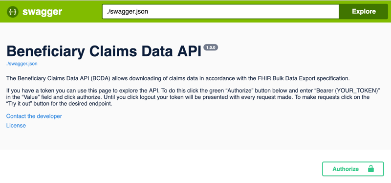
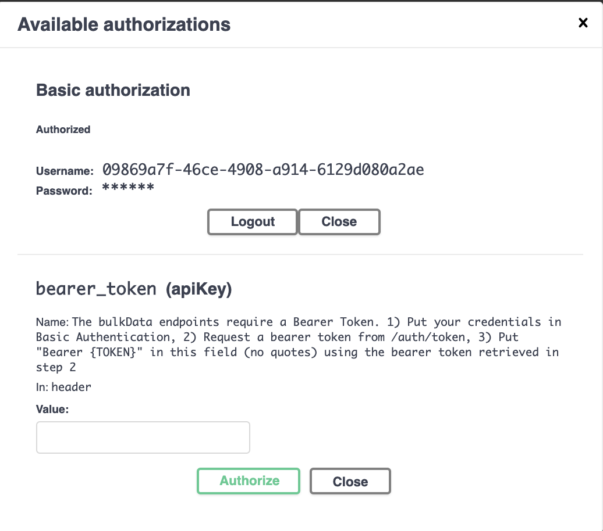
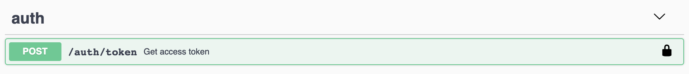
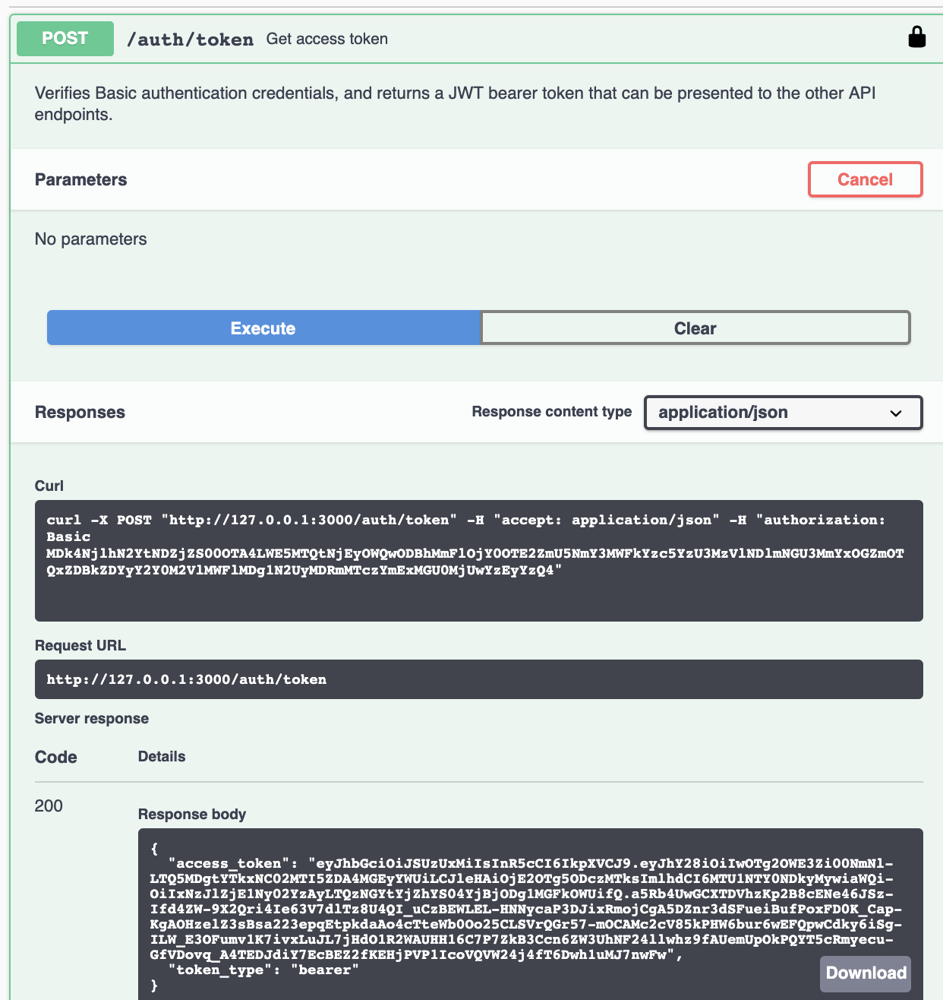
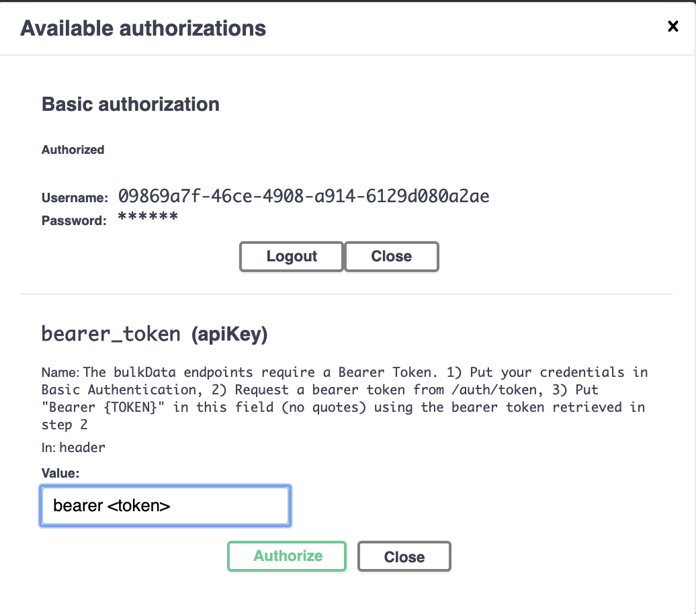
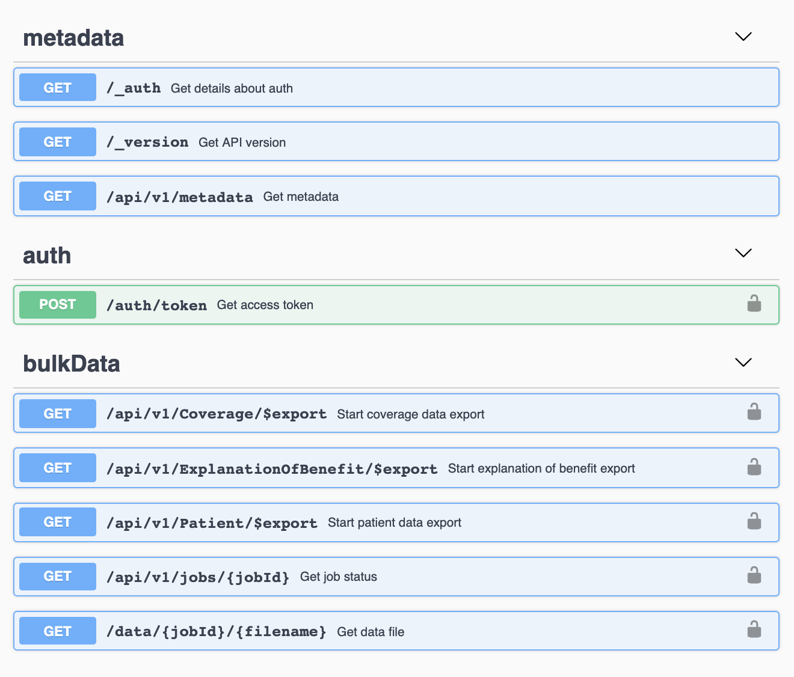
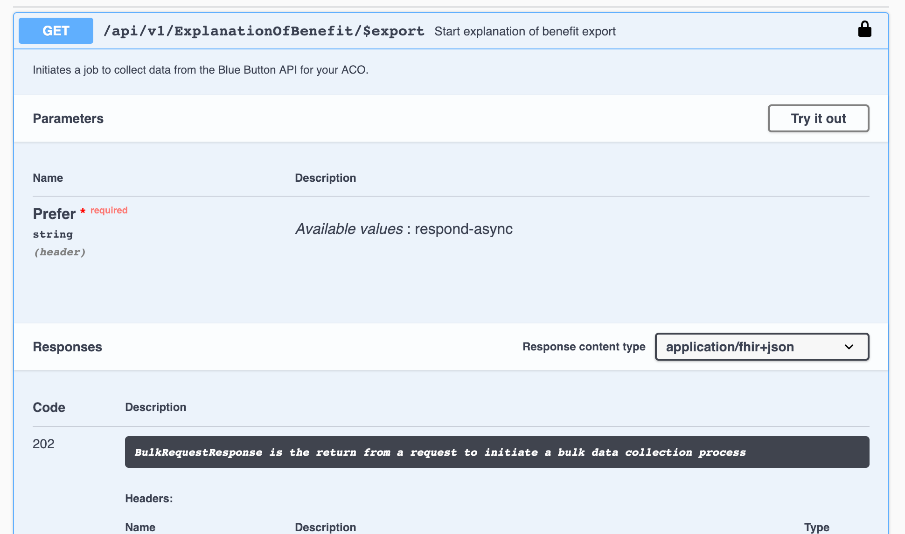
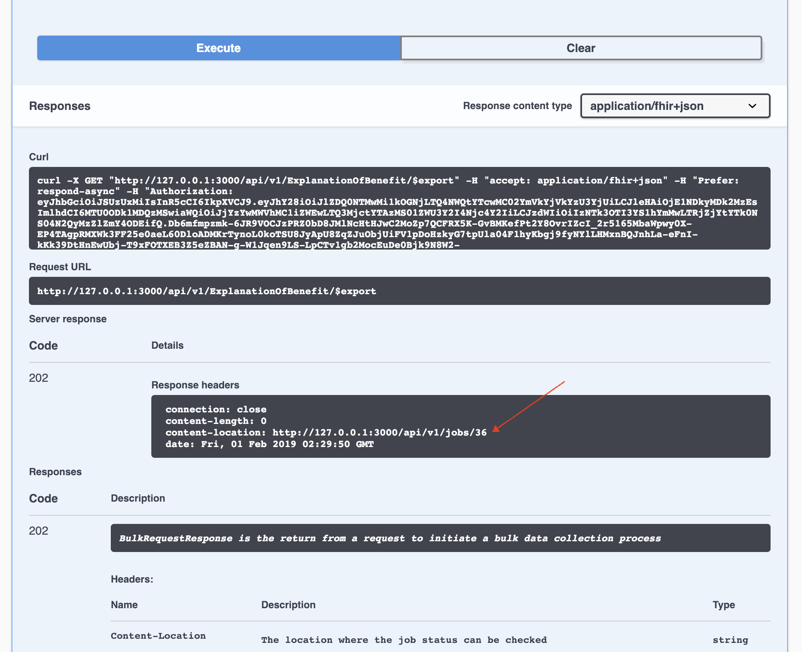

# How to decrypt BCDA data files
We provide an example of using Python to decrypt a file from BCDA. See below for examples using other programming languages.

### 1. Gathering the tools
To complete this decryption example, you will need:

  * A client ID and client secret that you should have received during registration
  * A file containing the RSA private key corresponding with the public key you provided during registration
  
  You can write your own decryption code later based on the documentation. This example uses the python example decryption code, which requires:
  
  * Python and pip installed on your computer
  * decrypt.py and requirements.txt downloaded from the BCDA github repository into the same directory
  * You have run pip install -r requirements.txt from that same directory to download any required libraries
  
### 2. Getting ready to decrypt
This decryption example picks up at step [X] of the Getting Started in Production guide. By this point, you have provided a bearer token to the API, made a request for data, and are waiting for the export job to complete. When the job is done, you should see a response in Swagger that looks like this:



Take special note of the new KeyMap section of the response. To decrypt the file, you will need the filename (the first part of the keymap, marked 1 in the image) and the symmetric key (the second part of the keymap, marked 2), as shown above. There are no spaces in either one. Copy these values from the KeyMap (filename and symmetric key) for later.
  
* **Note:** Sometimes one or more data points are unavailable. When this happens, the error section will contain a separate filename and symmetric key with a list of the patients involved.

The next step is to download the encrypted file.

* Open the data file section in Swagger (click /api/v1/jobs/{jobID}/{filename})
* Paste the job ID and filename into the appropriate boxes
* Click Execute
 

 
* Click the **Download file** link that appeared in the response section. Note that a large file may take a while to download.


  
### 3. Decrypting the file

After downloading the file, move to the command line. Navigate to the directory where you saved decrypt.py and requirements.txt from the Gathering the tools section.



Let’s first verify that Python is running properly.

* Run decrypt.py with the help argument (python decrypt.py -h). You should get the response shown below.



* Rename the downloaded file with the filename you saved earlier. **This is extremely important as the file name is used as part of the file decryption process and using a different file name will cause decryption to fail.**

**Note: At present, you must have the NDJSON file saved to the same folder as the decryption utilities in order to successfully decrypt.**



You are now ready to decrypt the file! The Python example decryption tool will print the decrypted contents to the console, so you can send the output to a file. Make sure to use the following syntax, with the entire command on the same line:

    python decrypt.py 
        --pk   [location_of_private_key] 
        --file [location_of_encrypted_file] 
        --key  [symmetric_key_value]
        > filename.txt



Take a look at the result. If you do not see unencrypted NDJSON (two example lines shown below), then skip ahead to the troubleshooting section.



## Troubleshooting

#### Authentication problems in Swagger
* Did you use Basic authorization to present the credentials (Client ID and Client Secret) you received separately from BCDA?
* After entering your credentials, did you get an access token from `/auth/token?`
* Did you put your access token in the `bearer_token` section of the authorization dialog, preceded by the word “Bearer “? (The capital B in “Bearer” is important.)
* Has your token expired? Use your credentials to get a new token from `/auth/token`.
* Is it possible you clicked on `Logout`? Is the lock on the `Authorize` icon not closed? Click it again, and after pasting your token in the `bearer_token` box, make sure to click the `Authorize` button.
* Are there any spaces or newlines in your token? Remove them and paste it as a single line.
* Do you get an HTTP 504 `GATEWAY_TIMEOUT` error? Make sure to add the word “Bearer” (and a space) before the token.

#### Python not installed
* Is this your first time running Python on your system? You might be interested in this [Windows installation guide](https://www.howtogeek.com/197947/how-to-install-python-on-windows/){:target="_blank"}

### Encryption issues
* Are you having  trouble with the private key? The best practice would be to keep your private key in a separate, secured directory. While you’re testing the encryption feature for the first time, however, you may find it useful to have all the files in the same directory.
* Have you saved the encrypted file with exactly the filename provided by the API? If not, rename it and try again.
* Is the symmetric key value provided with no spaces or newlines? Double-check that no characters are missing from the beginning or end of the key.

## Examples in other languages
These code samples are based on the filenames and symmetric keys included in the sample job status response above. If you are interested in sample code in other languages, please let us know via the Google Group.

[C#](https://github.com/CMSgov/bcda-app/tree/master/encryption_utils/C%23){:target="_blank"}
```bash
dotnet run decrypt.cs \
	--file /path/to/0c527d2e-2e8a-4808-b11d-0fa06baf8254.ndjson \
	--pk /path/to/bcda-app/shared_files/ATO_private.pem \
	--key 6c498a997001592ac05ace691fcf4a81724936c78937e24f90242c4f3081759f5365bef70a79eb0a6e145d22190b1178acf9f819399d27a4261efedf027642ca37d3f50cc0b941b105e35fc5b21cc785b171acb0ed299be16ff86fb457ff00d6855fefc9d403efdecbaca81ebffc85f8dbf1574d791640d392c5523482578ed232f7554880fa52d3471a4d919ab1ae8687e0442697cad7326aeb6ad0ddecaaeccaf61f952ef0cde2a3f15167b8854f8620440d8f1d9e09a0a39f1d04a3acf8178e5b6b28d9a062f09ff5fece3d16d9aacf7d43f4b94932d4f3268d1029f2874f3542ba71c858586393a80f45cb92b0cff9d2857b960045d733183d15c3599377 \
	> decrypted_output.ndjson
```

[Golang](https://github.com/CMSgov/bcda-app/blob/master/decryption_utils/Go/decrypt.go){:target="_blank"}
```bash

go build decrypt.go
./decrypt \
	--file /path/to/0c527d2e-2e8a-4808-b11d-0fa06baf8254.ndjson \
	--pk /path/to/bcda-app/shared_files/ATO_private.pem \
	--key 6c498a997001592ac05ace691fcf4a81724936c78937e24f90242c4f3081759f5365bef70a79eb0a6e145d22190b1178acf9f819399d27a4261efedf027642ca37d3f50cc0b941b105e35fc5b21cc785b171acb0ed299be16ff86fb457ff00d6855fefc9d403efdecbaca81ebffc85f8dbf1574d791640d392c5523482578ed232f7554880fa52d3471a4d919ab1ae8687e0442697cad7326aeb6ad0ddecaaeccaf61f952ef0cde2a3f15167b8854f8620440d8f1d9e09a0a39f1d04a3acf8178e5b6b28d9a062f09ff5fece3d16d9aacf7d43f4b94932d4f3268d1029f2874f3542ba71c858586393a80f45cb92b0cff9d2857b960045d733183d15c3599377 \
	> decrypted_output.ndjson
```

## Background How we encrypt
We encrypt the file as the last step in producing it, immediately before we return a final job status (the one that has a body and no X-Progress header). Please see our getting started guide for more on job status.

The steps in our encryption process are:

1. Generate a random 32 byte / 256 bit symmetric encryption key.
2. Generate a random nonce (also known as an Initialization Value, or IV).
3. Read the data from the file.
4. We use the nonce and encryption key to encrypt the data with the AES-GCM algorithm. We do not append additional data. The resulting cipher text output begins with a byte indicating the size of the nonce, the nonce itself, then the encrypted data, and finally the additional data.
5. Encrypt the symmetric key using the RSA public key you provided us. We use the filename as the label.
6. Write the encrypted file to the appropriate data directory.
7. Return the encrypted keys as hex-encoded strings in the body of the final job status method, along with file download urls and other information. There can be two files, a data file and an error file. Each file will be encrypted with a different symmetric key. An example body follows:

```
{
    "transactionTime": "2018-12-11T06:29:56.723792Z",
    "request": "https://api.bcda.cms.gov/api/v1/ExplanationOfBenefit/$export",
    "requiresAccessToken": true,
    "output": [
        {
            "type": "ExplanationOfBenefit",
            "url": "https://api.bcda.cms.gov/data/1/0c527d2e-2e8a-4808-b11d-0fa06baf8254.ndjson"
            "encryptedKey": "6c498a997001592ac05ace691fcf4a81724936c78937e24f90242c4f3081759f5365bef70a79eb0a6e145d22190b1178acf9f819399d27a4261efedf027642ca37d3f50cc0b941b105e35fc5b21cc785b171acb0ed299be16ff86fb457ff00d6855fefc9d403efdecbaca81ebffc85f8dbf1574d791640d392c5523482578ed232f7554880fa52d3471a4d919ab1ae8687e0442697cad7326aeb6ad0ddecaaeccaf61f952ef0cde2a3f15167b8854f8620440d8f1d9e09a0a39f1d04a3acf8178e5b6b28d9a062f09ff5fece3d16d9aacf7d43f4b94932d4f3268d1029f2874f3542ba71c858586393a80f45cb92b0cff9d2857b960045d733183d15c3599377"
        }
    ],
    "error": [
        {
            "type": "OperationOutcome",
            "url": "https://api.bcda.cms.gov/data/1/0c527d2e-2e8a-4808-b11d-0fa06baf8254-error.ndjson"
        }
    ],
    "KeyMap": {
        "0c527d2e-2e8a-4808-b11d-0fa06baf8254-error.ndjson": "4fd09523856ff24b9505c921973847fd4b1daf02753b3979373e8be8ea7da5418faa091535003a097ba8013582707535d0f5ea60380036c8be318094092c1936d0a80981ee2465009871c2fe56312e65239fea3785753684de19599d3219c545c24ad12018be4b86a39e742035e2559dcbe6169b6a3354f34bd2fbd569f88b70d3d1d13f62521693e779d3d2479d36515e086518bfd1140655d3b6100b05377b3ccacdfc10772c6a58178fae70b3a6a6ef897f64ae4a60045247b02331930ee6f15db45271afb2a432a8084170469458eef87c3a96ff6c4664c53b4867842b8650b3105860d29e87f43aad2c528d635f0eb02dc2bc905bf43bb1d1dd7f2cad3d",
        "0c527d2e-2e8a-4808-b11d-0fa06baf8254.ndjson": "6c498a997001592ac05ace691fcf4a81724936c78937e24f90242c4f3081759f5365bef70a79eb0a6e145d22190b1178acf9f819399d27a4261efedf027642ca37d3f50cc0b941b105e35fc5b21cc785b171acb0ed299be16ff86fb457ff00d6855fefc9d403efdecbaca81ebffc85f8dbf1574d791640d392c5523482578ed232f7554880fa52d3471a4d919ab1ae8687e0442697cad7326aeb6ad0ddecaaeccaf61f952ef0cde2a3f15167b8854f8620440d8f1d9e09a0a39f1d04a3acf8178e5b6b28d9a062f09ff5fece3d16d9aacf7d43f4b94932d4f3268d1029f2874f3542ba71c858586393a80f45cb92b0cff9d2857b960045d733183d15c3599377"
    },
    "JobID": 1
}
```

The KeyMap object within our job status response has keys, values:

`"<filename/label>": "<hex-encoded-symmetric-key>"`

for each of the files listed in the output attribute of the response.

When you receive the final job status response, you should save the keys associated with the files so that they are available to you when you are ready to decrypt the file(s). You should also save the output.url and the error.url.
Again remember the filenames must be preserved when saving the files. See section 3 under [How to decrypt BCDA data files](#how-to-decrypt-bcda-data-files) for more guidance.

When you are ready to decrypt the files, you make a request to output.url for the data file, and to error.url for the error file. These are protected endpoints, so you must obtain and use a token.
To decrypt the files, you must use the same algorithm (AES-GCM), and follow these steps:

1. Decrypt the symmetric key you saved from the final job status body, using your RSA private key that is the mate to the public key we have.
2. Initialize the AES-GCM cipher with the symmetric key decoded in the previous step.
3. Decode the cipher text.
4. Do something useful with the data.