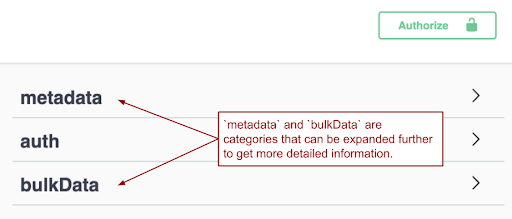
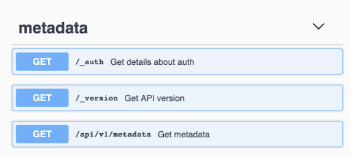
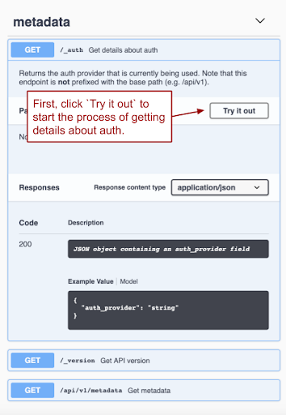
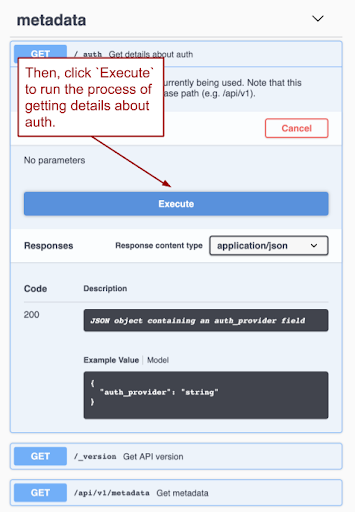
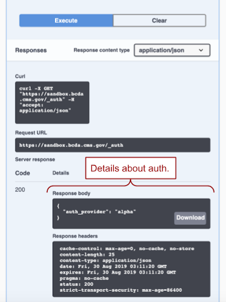
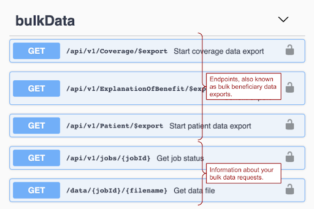
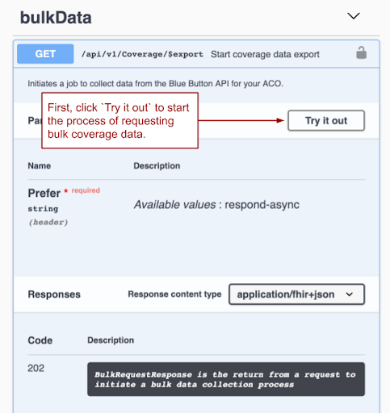
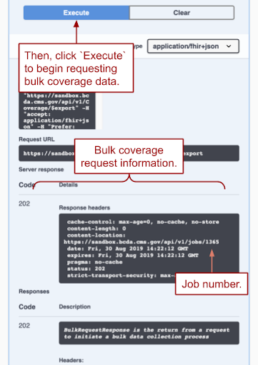
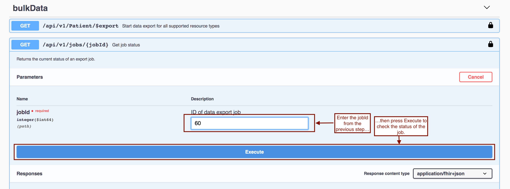
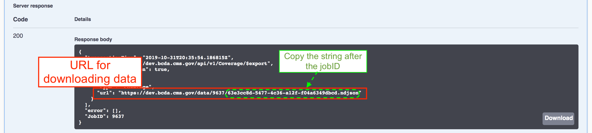

# Requesting prod access
* As BCDA launches into our production beta, we are slowly onboarding small groups of Shared Savings Program ACOs into the production environment. To put your ACO in the queue for access, please send an email to bcapi@cms.hhs.gov with your name and your ACO’s name, ID number, and track. ACOs will be onboarded to production in the order in which requests are received. While you wait, you can get familiar with the API in the sandbox environment, [https://sandbox.bcda.cms.gov/]; review the data structure, [link to guide to working w/bcda data]; and join the BCDA Google Group, [https://groups.google.com/forum/#!forum/bc-api], to have your questions answered.

* Note: some of our early production beta partners have encountered issues accessing the API due to internal firewalls. If your corporate IT uses an internal DNS server, you may not be able to access the API. As you request production access, you may want to check in with your internal IT team to discuss your company’s network structure.

This page is intended for a user who has little to no experience with APIs, and provides a guided walkthrough for working with BCDA using our interactive documentation. More advanced API users may be better served by the Technical Setup guide. If you’re not sure where to go, start here!

## Getting Started with APIs
  * What’s an API?
    * An API (Application Programming Interface) is a set of features and rules that exist inside a software program that allows other software programs to interact with it. For example, you can build an app that uses the Twitter API to get information or data from a user's Twitter account. APIs are used in a wide variety of ways, but for our purposes, you can think of an API as a pipeline that can allow your ACO’s computer systems to receive data directly from CMS’ databases.
    * Need more information about APIs? Here are some great introductions:
      * [Introduction to Web APIs](https://developer.mozilla.org/en-US/docs/Learn/JavaScript/Client-side_web_APIs/Introduction){:target="_blank"}
      * [An Intro to APIs](https://www.codenewbie.org/blogs/an-intro-to-apis){:target="_blank"}
  * Do I need to know how to code?
    * You do not need to know how to code!  Our documentation is written so that everyone -- regardless of technical exposure -- can access beneficiary data. For this walkthrough, we’ll be using a platform called Swagger, where you’ll be able to interact with the API through a web interface.
    
## Setting up your credentials in Swagger
  * Navigating to Swagger
  
## Making your first requests for data
### 1. Getting comfortable in Swagger
There are two categories of information that you can retrieve through BCDA: metadata, and bulk beneficiary data.

**Metadata** in BCDA includes information about the platform that is making, storing, and verifying credentials and tokens (the auth provider); information about the API’s version; and information about the actions you can perform using the API itself (also duplicatively termed metadata). There is no PII or PHI in the **metadata** endpoint, so you can access this endpoint without having to be authorized.

### 2. Looking at BCDA Metadata

We’ll use `auth` as an example here.

Under the Metadata endpoint, click on `/_auth` to expand that section. After the information field expands, as shown below, click `Try it out`.

Then, as shown below, click `Execute` to run the process of getting details about `auth`.

As shown below, clicking `Execute` returns details about the authorization and authentication provider BCDA is using.

You can repeat this process with the `/_version` and `/api/v1/metadata` endpoints as well.

If you’d like to do this from the command line or implement this API call in code, look in the `Curl` section for the request you just made.

### 3. Learning about the Bulk Data Endpoints

The `bulkData` category provides information about beneficiaries.  As shown below, there are five pieces of information within the `bulkData` category.  The first three -- Explanation of Benefit (EOB) data, Patient data, and Coverage data -- are endpoints that return information about your ACO’s assigned or assignable beneficiaries. The last two pieces of information -- jobId and filename -- return information about the request you’re making.

* **Explanation of Benefit** data includes claims data for your beneficiaries.
* **Patient** data includes identification information about your assigned or assignable beneficiaries.  
* **Coverage** data includes each beneficiary’s Medicare coverage plan.

### 4. Making your first request for beneficiary data
To get any bulk beneficiary data, you must first be authorized with BCDA. Make sure you’ve followed the steps above for Setting up your credentials in Swagger before moving forward.

Retrieving beneficiary data comprises two steps:
#### 1. Starting a job to acquire data from a specific endpoint
#### 2. Retrieving data via a job request

We’ll use the `Coverage` endpoint as an example of how to perform both steps. You’ll be able to follow the same instructions for Explanation of Benefit and Patient data as well.

First, click on `GET /api/v1/Coverage/$export`, then click `Try it out`.

Then, as shown below, click Execute to start the process of requesting Coverage data.  Make sure you note the **job number** (also known as `jobId`)  in the **response header**, since you’ll need this job number to track the status of your data request.

If you’d like to use the command line or implement this API call in code, look in the `Curl` section (shown in the image above) for the request you just made. Not far below that, you can see the response: an `HTTP 202 Accepted` giving a link in the content-location header for status information on your Coverage job.

### 5. Getting your data
There are three steps to retrieving the requested Coverage data:
  1. Checking the status of your job
  2. Downloading your bulk data file
  3. Decrypting your data file

Depending on the number of beneficiaries prospectively assigned or assignable to your ACO, it may take a while for your data file to be ready to download. While you wait, you can check the status of your job to find out when the file is ready. 

You can check the status of the job by entering the job number into the `jobId` text field, as shown in the image below.

Once the job is completed, you can download the file by clicking on the Download button, as shown in the image below.  You will have one hour before your token expires, and you will need to get another from token if it expires before you are finished interacting with the API.  You will also want to copy the filename.

The file you’ve downloaded will be encrypted. Follow the decryption walkthrough to learn how to decrypt and view the NDJSON data contained inside it.

Once you’ve decrypted the file, you’ll want to know what to do with the data. We’ve provided a guide to working with BCDA data to help you, including a crosswalk between CCLF fields and the corresponding sections of the NDJSON files.

## Frequently asked questions about making requests

* How often can I request data from BCDA?
BCDA data will be updated weekly, so you will be able to make requests and expect to retrieve new data on a weekly basis. If you’re already requesting data from one endpoint and try to request data from that endpoint again while the first request is processing, you’ll receive a 429 Too Many Requests error.

* How will I know when my data is ready?
You can check the status of your data request by following the instructions outlined in 3.2.2.2: Retrieving the data via the job request.  A status of 200 Ok means that the job, also known as a data request, is complete.  A status of 202 Accepted means that BCDA is processing the job.

* How long do I have before my file is deleted?
You will need to download the data file within 24 hours of starting the request to a specific endpoint.

* Whoa, why is this data file so big?
In the first iteration of BCDA in production, each request to a bulk data endpoint sends back seven years of historical data for your beneficiaries. In future iterations, we’ll add a way for you to limit the data to a specific date range.